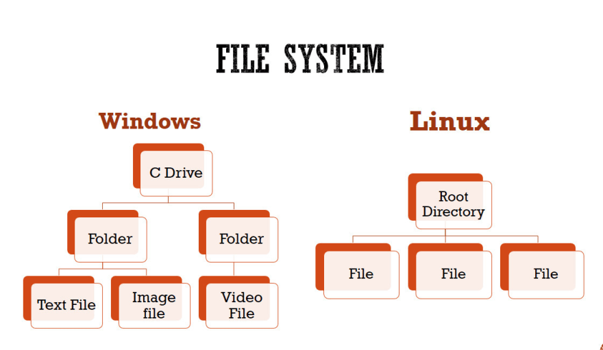

## **Linux-Basics**

 *In this repository you will see various linux commands being used as docker has its foundation built on top of linux  concepts so it is very important to fully brush up the linux concepts before proceeding further.*

- Linux is an open source operating system so it is common for us to see specialized version of linux being made time-to-time for different purposes.

- Some of the popular linux distributions are-:
  - Ubuntu
  - Debian
  - Alpine
  - Fedora
  - CentOS

- In this repository you will be studying docker with respect to ubutu linux.
  
- In case you are on a windows machine run the following command after installing docker.

    `docker run ubuntu`

- Here docker will first try to look up for image locally and then it will pull it from docker hub.

- To check if the image has successfully been pulled run the following command.
  
  `docker ps`

- To our surprise the command will not show you any container because it only shows the running containers.So use a modified version of command to see the result.

  `docker ps -a`  

- To run the container in interactive mode use the following command-:
  
    `docker run -it ubuntu`

- Now you will see the ubuntu shell opened. A shell is a program that takes our command and passes them to OS for execution whic will look like

       root@43adbd23f334:/# 

- By default you will be logged in as root user which has highest privillages.
  
- `43adbd23f334` determines name of the machine *(container name generated by docker in our case )*.
  
- The `/` symbol after after `:` represents that we are in root directory in file system.
  
- After the current path you will be able to see `#` symbol because we have the root privllages.If you would login as a normal user you will see a `$` symbol instead.
  
### Fun Facts

- In windows we use `\` for representing file system but in linux we use `/` .
  
- To see the location of shell in linux run-:
  
  `echo $0`

- To see your username run-:

  `whoami`  

- To run previously executed commands-:

    ```
      history
      !"command-number"
    ```

### Package Management in Linux

- In ubuntu we deal with apt package manager which stands for advanced package tool.
- With time new packages are added and old ones are updated so we should always synchronize them with our ubuntu before installing any package by running-:
  
  `apt update`

### File System in Linux

- Everything in linx is a file including devices,irectories,network sockets etc.
  
  

- Like windows file system in linux is organised in tree-like hierarchial structure.
  
- The main coponents of root directory are-:
  
`/boot` : Contains the boot loader

`/home` : Contains the home directories of users.

`/bin` : All the executable binaries and commands used by all the users on the system are located here.

`/sbin` : This contains the system executable binaries typically used by system administrators.

`/lib` : Contains the system libraries that support the binaries in /bin and /sbin.

`/etc` : Contains the configuration files for network, boot-time, etc.

`/proc` : Contains information about the process running.

`/media` : Mount point for removable media.

`/mnt` : Mount point for temporarily mounted file systems.

`/root` : Home directory for root users.

`/usr` : Multi-user utilities and Applications.

`/dev` : This has the device files i.e. usb, terminal device or any other device attached to the system are shown here.

`/tmp` : This is the temporary directory where many processes create the temporary files required. This is purged each time the machine is booted.

